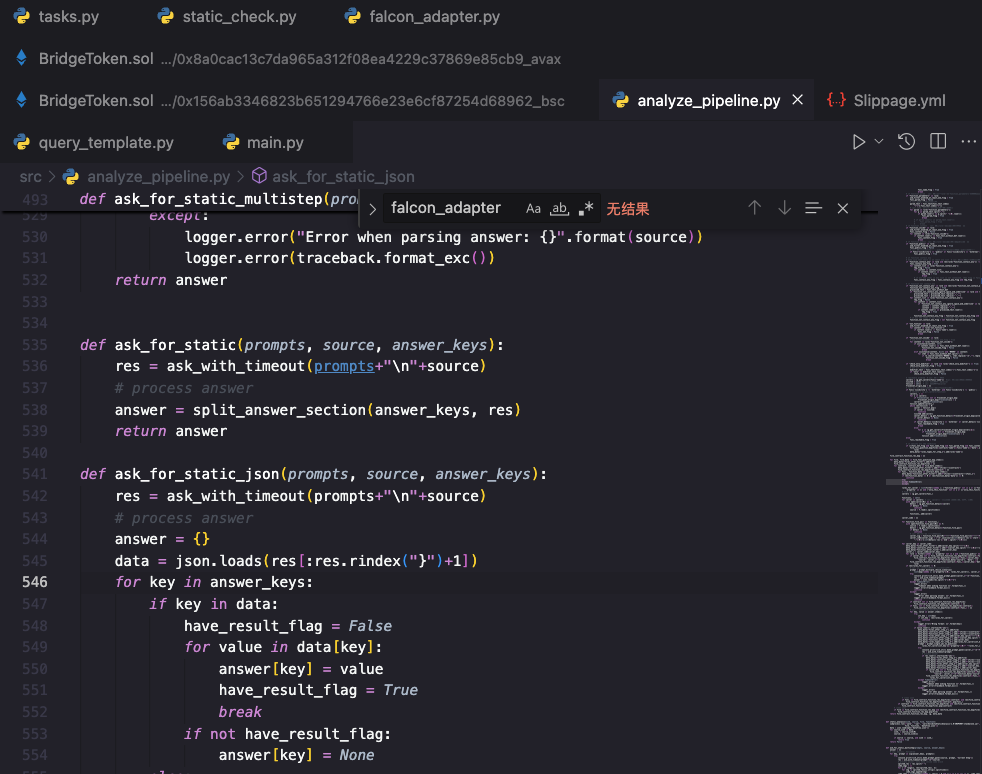

## VSCode 插件

### 前端开发必备

#### 1. HTML CSS Support

<!-- truncate -->

html id 和 class 属性补全

#### 2. IntelliSense for CSS class names in HTML

根据在工作区中找到的定义或通过 link 元素引用的外部文件，为 HTML 类属性提供 CSS 类名补全

#### 3. JavaScript (ES6)code snippets

ES6 语法中的 JavaScript 代码片段提示（支持 JavaScript 和 TypeScript）。

#### 4. ES7+ React/Redux/React-Native snippets

ES7+ 中的 JavaScript 和 React/Redux 代码段提示，带有 Babel 插件功能

#### 5. Paste JSON as Code

粘贴 json 时自动转化为 ts 接口定义，或其他类型

#### 6. Color Hightlight

html 中颜色代码实时显示

#### 7. Markdown Preview Enhanced

markdown 文件在 vscode 中的预览能力

### git 相关

#### 1. GitLens

编译器中显示 git 提交信息，付费版还能 git 分支管理

#### 2. Git Graph

免费版的 git 分支可视化和管理

## VSCode 设置

#### 1. 标签页多行显示，不滚动

想让标签页能多行显示，不需要滚动查看很麻烦

`首选项` > `设置` > 打开`工作区`设置

输入 workbench.editor.wrapTabs，勾选该设置即可
