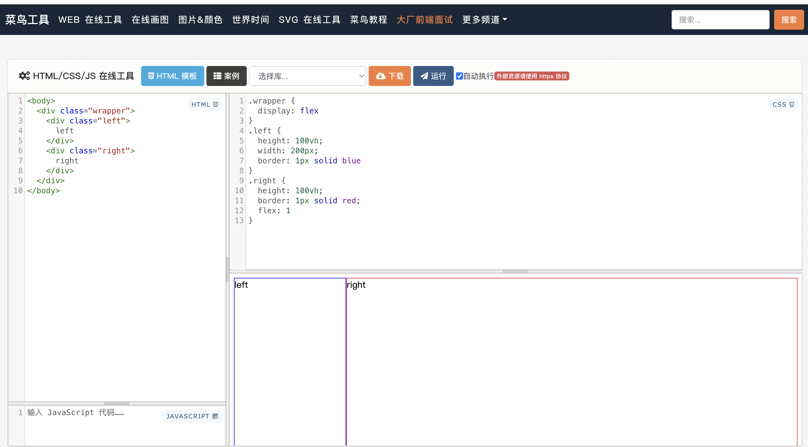
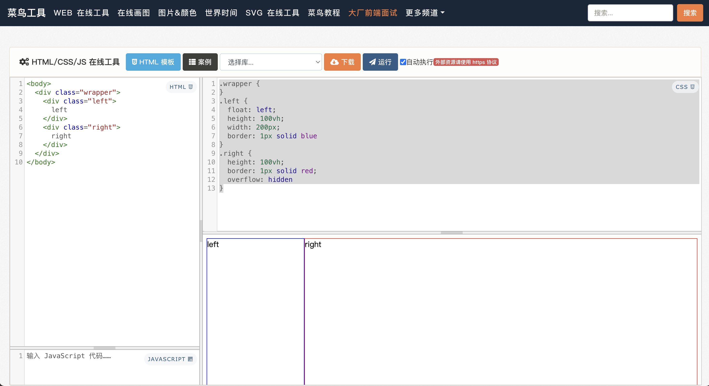
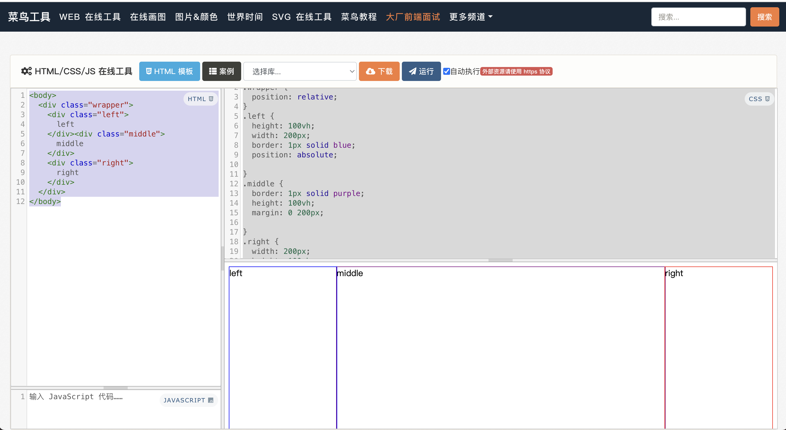

# 布局

## 两栏布局

1. container 用 flex 布局，左边区域宽度固定，右边区域 flex: 1

```html
<body>
  <div class="wrapper">
    <div class="left">left</div>
    <div class="right">right</div>
  </div>
</body>
```

```css
.wrapper {
  display: flex;
}
.left {
  height: 100vh;
  width: 200px;

  border: 1px solid blue;
}
.right {
  height: 100vh;
  border: 1px solid red;
  flex: 1;
}
```



2. 左边区域浮动，右边区域生成 BFC

```css
.wrapper {
}
.left {
  float: left;
  height: 100vh;
  width: 200px;
  border: 1px solid blue;
}
.right {
  height: 100vh;
  border: 1px solid red;
  overflow: hidden;
}
```



3. 左边区域 absolute 定位，右边区域 margin-left 为左边的宽度值

```css
.wrapper {
  position: relative;
}
.left {
  position: absolute;
  height: 100vh;
  width: 200px;
  border: 1px solid blue;
}
.right {
  margin-left: 210px;
  height: 100vh;
  border: 1px solid red;
  overflow: hidden;
}
```

4. 利用浮动，左边区域向左浮动，右边区域 margin-left 设置为左边的宽度值，宽度设置为 auto（撑满整个父元素）

```css
.wrapper {
}
.left {
  float: left;
  height: 100vh;
  width: 200px;
  border: 1px solid blue;
}
.right {
  margin-left: 210px;
  width: auto;
  height: 100vh;
  border: 1px solid red;
}
```

## 三栏布局

1. container flex 布局 ，左边区域右边区域固定宽度，中间设置 flex: 1

```html
<!-- 注意middle的位置 -->
<body>
  <div class="wrapper">
    <div class="left">left</div>
    <div class="middle">middle</div>
    <div class="right">right</div>
  </div>
</body>
```

```css
.wrapper {
  display: flex;
}
.left {
  height: 100vh;
  width: 200px;
  border: 1px solid blue;
}
.middle {
  border: 1px solid purple;
  height: 100vh;
  flex: 1;
}
.right {
  width: 200px;
  height: 100vh;
  border: 1px solid red;
}
```

2. 左边区域左浮动，右边区域右浮动，中间创建 BFC

```html
<!-- 注意middle的位置 -->
<body>
  <div class="wrapper">
    <div class="left">left</div>
    <div class="right">right</div>
    <div class="middle">middle</div>
  </div>
</body>
```

```css
.wrapper {
}
.left {
  float: left;
  height: 100vh;
  width: 200px;
  border: 1px solid blue;
}
.middle {
  border: 1px solid purple;
  height: 100vh;
  overflow: hidden;
}
.right {
  float: right;
  width: 200px;
  height: 100vh;
  border: 1px solid red;
  right: 200px;
}
```

3. 左边区域 absolute，右边区域 absolute，中间区域 margin 为左右宽度

```html
<body>
  <div class="wrapper">
    <div class="left">left</div>
    <div class="middle">middle</div>
    <div class="right">right</div>
  </div>
</body>
```

```css
.wrapper {
  position: relative;
}
.left {
  height: 100vh;
  width: 200px;
  border: 1px solid blue;
  position: absolute;
}
.middle {
  border: 1px solid purple;
  height: 100vh;
  margin: 0 200px;
}
.right {
  width: 200px;
  height: 100vh;
  border: 1px solid red;
  position: absolute;
  right: 0;
  top: 0;
}
```


