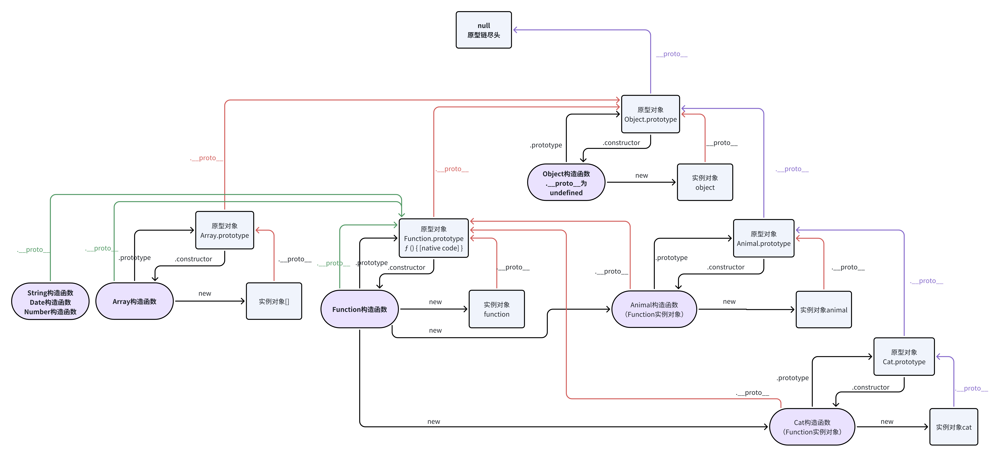

# 继承与原型链

> 参考：[https://developer.mozilla.org/zh-CN/docs/Web/JavaScript/Inheritance_and_the_prototype_chain](https://developer.mozilla.org/zh-CN/docs/Web/JavaScript/Inheritance_and_the_prototype_chain)

继承：只有对象（Object），每个对象都有一个私有属性 `[[Prototype]]` 或者说 `__proto__` 指向另一个名为 prototype 的对象，这个对象也被称为“原型对象”，原型对象也有一个自己的原型，层层向上直到一个对象的原型为`null`。`null`是没有原型的，并作为这个原型链中的最后一个环节。

首先来一张图，一图胜千言：


## 基于原型链的继承

#### 🔗 面试题：解释一下原型链吧

javascript 对象有一个指向原型对象的链，当试图访问一个对象的属性时，它不仅仅在该对象上受损，还会搜寻该对象的原型，以及原型的原型，依次层层向上搜索，直到找到一个名字匹配的属性或达到原型链的末尾。

> 访问原型对象的方法：`Object.getPrototypeOf(someObject)`和`Object.setPrototypeOf(someObject, parentObject)`，是在访问对象的内部插槽`[[Prototype]]`，避免使用`obj.__proto__`属性来访问。注意不应与函数的`func.prototype`属性混淆，这个属性在给定函数被用作构造函数时分配给所有对象示例的`[[Prototype]]`。

但是可以定义对象的`__proto__`属性，而且可以嵌套滴

```js
const o = {
  a: 1,
  __proto__: {
    b: 2,
    c: 3,
    __proto__: {
      d: 4,
    },
  },
};
```

当继承的函数被调用时，this 值指向的是当前继承的对象，而不是拥有该函数属性的原型对象。

```js
const parent = {
  value: 2,
  method() {
    return this.value + 1; // 注意这个this
  },
};
const child = {
  __proto__: parent,
};
console.log(child.method()); // 3

child.value = 200;
console.log(child.method()); // 201
```

## 构造函数

构造函数的作用，类似于通过构造函数创建的每一个实例都会自动将构造函数的 `prototype` 属性作为其 `[[Prototype]]`。

并且构造函数的.prototype 属性默认具有一个自有属性`constructor`，引用了构造函数本身，即 `Box.prototype.constructor === Box`

一个普通函数（没有人为定义 prototype 属性的函数），他的 prototype 属性为空对象`{}`，但是**箭头函数没有默认的原型属性**哦，为 undefined

默认情况下，任何函数的 prototype 属性的 [[Prototype]] 都是 Object.prototype

```js
// 一个构造函数
function Box(value) {
  this.value = value;
}
// 使用Box构造函数创建的所有盒子都将具有有属性getValue，是在
Box.prototype.getValue = function () {
  return this.value;
};
const box1 = new Box(1);
/**
 * 相当于
 * const box1 = {
 *   value : 1,
 *   __proto__: {
 *    getValue() {
 *      return this.value
 *   }
 * }}
 * 也相当于
 * const box1 = Object.create(Box.prototype)
 */
```

## 类

类的本质是构造函数的语法糖，比如上面的 Box 构造函数可以重写为类：

```js
class Box {
  constructor(value) {
    this.value = value
  }

  // 除constructor之外的方法，都相当于在Box.prototype上创建的方法
  getValue() {
    rethrn this.value
  }
}
```

## 预设的构造函数

```js
Object;
Array;
Function;
RegExp;
Number;
String;
```

他们和字面量语法有关，比如

```js
// 对象字面量（没有 `__proto__` 键）自动将
// `Object.prototype` 作为它们的 `[[Prototype]]`
const obj = { a: 1 }; // 相当于 const obj = new Object({a: 1})
Object.getProptotypeOf(obj) === Object.prototype;

// 数组字面量自动将 `Array.prototype` 作为它们的 `[[Prototype]]`
const array = [1, 2, 3]; // 相当于 const array = new Array(1, 2, 3);
Object.getPrototypeOf(array) === Array.prototype; // true

// 正则表达式字面量自动将 `RegExp.prototype` 作为它们的 `[[Prototype]]`
const regexp = /abc/; // 相当于 const regexp = new RegExp("abc");
Object.getPrototypeOf(regexp) === RegExp.prototype; // true

// 函数将 `Function.prototype` 作为他们的 `[[Prototype]]`，所以具有call、bind方法
function f() {
  return 2;
}
Object.getPrototypeOf(f) === Function.prototype; //true
```

一些内置构造函数的 prototype 属性本身就是其自身的实例。例如，Number.prototype 是数字 0，Array.prototype 是一个空数组，RegExp.prototype 是 /(?:)/。
Function.prototype 本身就是一个无操作函数， String.prototype 是一个空字符串

## 实现继承

#### 🔗 面试题：继承有哪几种方法

Object.getPrototypeOf(Object.prototype) === null

有多种方法哦

### 使用语法

就是手写子类对象里的`__proto__`属性

```js
const base = { a: 1 };

const derived = {
  b: 2,
  __proto__: base,
};
// 原型链
// derived --> base  --> Object.prototype --> null
derived.a; // 1
```

### 🔆 使用构造函数和 Object.create()（原型链继承）

使用构造函数、call 函数、Object.create()

**能够实现和 class extends 一样的效果**

```js
// 父类构造函数
function Base() {
  this.name = "base";
}
Base.prototype.getName = function () {
  return this.name;
};
// 子类构造函数
function Derived() {
  // 执行父类的构造函数，并且父类构造函数中的this指向子类示例，让原来在父类造成函数中this.xxx都到子类示例自己身上
  Base.call(this);
}

// 创建以父类的prototype对象为__proto__属性的对象作为子类的prototype对象
// 但是这时的Derived.prototype是没有自己的constructor属性的
Derived.prototype = Object.create(Base.prototype);
// 注意 ：与使用 Derived.prototype = new Base()相比，等式右边创建出来的对象带有的属性是有区别的
// Object.create创建出来的对象只有一个具有[[Prototype]]属性
// 而new出来的对象，父类的构造逻辑会在实例化时执行。所以子类的prototype对象上会有name属性，但这一般是没有用的

// 添加子类自己的构造函数
Derived.prototype.constructor = Derived;

const de = new Derived();
de.getName();

// de --> Derived.prototype --> Base.prototype --> Object.prototype --> null
```

### 使用类

extends 语法

```js
class Base {
  constructor(a) {
    this.a = a;
  }
}
class Derived extends Base {
  constructor(b) {
    super(b);
  }
  getValue() {
    return this.a;
  }
}
const de = new Derived(555);
de.getValue();
// de --> Derived.prototype --> Base.prototype --> Object.prototype --> null
```

### 使用 Object.setPropertyOf()

可以修改现有对象的**proto**属性

```js
const obj = { a: 1 };
const anotherObj = { b: 2 };
Object.setPrototypeOf(obj, anotherObj);
// obj --> anotherObj --> Object.prototype --> null
```
