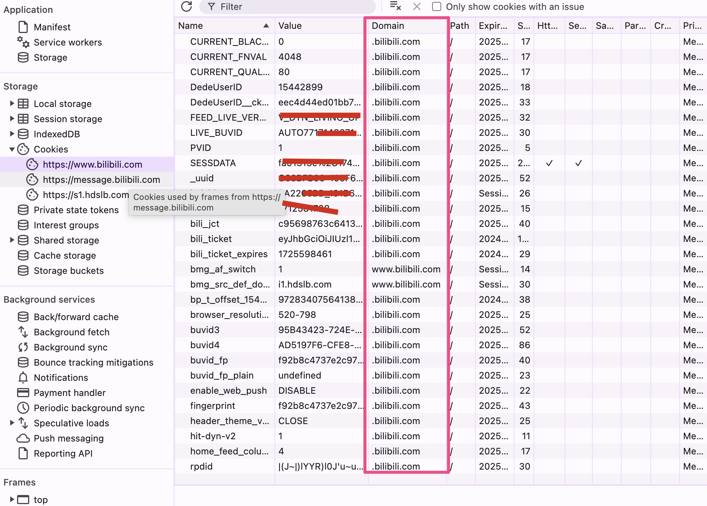
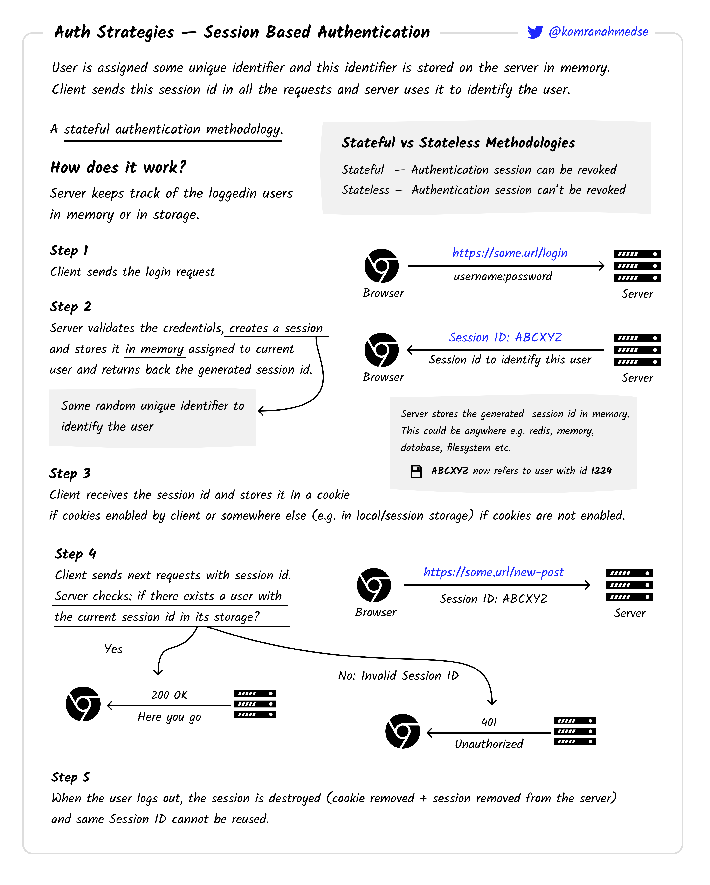

# Cookie

是服务器发送给浏览器的，让浏览器保存在本地的一小块数据。

## Cookie 的属性有哪些

### 用来防止攻击的

#### `Secure` 属性 —— 防止中间人攻击

标记了这个属性的 cookie 只应该通过被 https 协议加密过的请求发送给服务端，不会使用 http 发送，这意味着中间人无法轻松访问到它。http 站点是无法使用 Secure 属性来设置 cookie 的哦

#### `HttpOnly` 属性 —— 防止跨站脚本 XSS 攻击

标记了这个属性的 cookie 无法被 javascript 脚本中的 `Document.cookie` API 访问到

### 用来定义 Cookie 发送位置（作用域）的

`Domain` 和 `Path` 定义了 Cookie 的作用域：即允许 Cookie 应该发送给哪些 URL

#### `Domain` 属性

指定了哪些主机可以接受 Cokie。如果不指定，默认为同有一 host（例：完整的www.abc.com）设置cookie，不包含子域名（例：www）。
如果指定了 Domain，则一般包含子域名，因此，指定 `Domain` 比省略它的限制要少。

例如，B 站的 cookie 都设置了`Domain=.bilibili.com` ，则 Cookie 会包含在子域名中（如`suibianxie.bilibili.com`），本地调试的时候，我们会把域名都改成`某某某.bilibili.com`，这样只要浏览器上登录了系统，本地跑的网页就会带着用于身份验证的 cookie 信息了

#### `Path` 属性

Path 属性指定了一个 URL 路径，该 URL 路径必须存在于请求的 URL 中，以便发送`Cookie` 标头，。以字符 %x2F (“/”) 作为路径分隔符，并且子路径也会被匹配。

例如，设置 `Path=/docs`，则以下地址都会匹配：

- `/docs`
- `/docs/`
- `/docs/Web/`
- `/docs/Web/HTTP`
  但是这些请求路径不会匹配以下地址：

- `/`
- `/docsets`
- `/fr/docs`

#### `SameSite` 属性

允许服务器指定是否/何时通过跨站点请求发送，提供了针对跨站请求伪造攻击（CSRF）的保护。有三种可能的值：

- `Strict`： 使用 Strict，浏览器仅发送 cookie 以响应来自 cookie 源站点的请求。比如购物车信息
- `Lax`： 默认值。与 Strict 类似，但加上一条：在用户导航到 cookie 的源站点时发送 cookie（即使用户来自一个不同的站点）。比如在 A 站点点击商品广告跳到 B 站点商品详情页面然后 B 站点需要感知是来自 A 站点的并且显示奖励横幅
- `None`：如果 SameSite=None，则还必须设置 Secure 属性

## Cookie 的生命周期

- 会话期 cookie：没有 Max-Age 或 Expires 属性的 cookie，在当前 session 结束之后删除，用于身份认证的 cookie 一定要用这种！
- 持久性 cookie： 在过期时间 `Expires` 指定日期 (这个时间是基于客户端的，与服务端时间无关) 或 有效期 `Max-Age`指定的一段时间后删除

## 基于 cookie 的身份验证方案

其实也就是**基于 session 的身份验证方案**

特点：

- 服务端生成一个 sessionId 来识别一个用户
- 认证信息存储在服务端内存中
- 有状态的（有状态——认证 session 可以被撤销 ；无状态——认证 session 不能被撤销）
- 认证信息在每次请求中跟随请求头发送
- 用户退出后，服务器清除数据库 sessionId ，并使 cookie 过期，浏览器也会从 cookie 中删除它，这个 sessionId 就不能再用了

## 第三方 cookie

比如在`Domain`里设置了其他的域，或者是持久性 cookie

第三方 cookie 是指由网站 A 设置的 cookie，但由网站 B 读取的情况。这种情况通常发生在网站 A 和网站 B 属于不同的域名，但网站 B 包含了来自网站 A 的脚本、图片或其他资源。

用途：

- 广告定位：通过跟踪用户的浏览习惯，广告商可以向用户展示更相关的广告。
- 用户行为分析：网站可以使用第三方 cookie 来分析用户的行为模式，从而优化网站内容和用户体验。
- 会话管理：在某些情况下，第三方 cookie 用于管理跨多个网站的用户会话。
