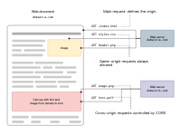

# 同源与跨域

🔗 面试题：什么是同源策略？

一个 origin 的 js 脚本在未经允许的情况下，不能访问另一个域的内容。同源指的是：协议一致、域名一致和端口相同。

同源策略控制不同源之间的交互，例如在使用 XHR 或`` 标签时会收到同源策略的约束。跨源交互分为三类：

- 跨源写操作：一般是允许的，比如链接、重定向和表单提交
- 跨源资源嵌入：一般是允许的
  - 嵌入`<script>` 、嵌入`<link>`的 CSS、通过``展示图片、通过`<iframe>`载入任何资源。
- 跨源读操作：一般是不允许的。

## 源的更改

源 origin 和域 domain 是什么区别？？？

## 阻止跨源访问

- 对于跨源写操作，在请求头中加上一个 CSRF token

## 跨源数据存储访问

存储在浏览器中的数据，Web Storage 和 Indexed DB，是以源进行分割的，每个源都有自己单独的存储空间。一个源中的 js 脚本不能对属于其他源的数据进行读写操作。

但是 cookie 不一样。一个原棉可以为本域和其父域设置 cookie。当设置 cookie 时，可以使用`Domain`、`Path`、`Secure` 和 `HttpOnly` 标记来限定可访问性.

# 跨域

其实一般说的跨域就是跨源的情况。这个会对业务的实现造成限制，那么如何解除这个限制呢？这就是我们说的跨域方法

## CORS

通过设置 http headers 的方式来突破同源限制。cors 通过允许服务器标识除了它自己以外的其他源，使得浏览器允许这些源访问加载自己的资源（告诉浏览器“你不要屏蔽这个 http 请求啊”）。



### cors 的使用场景

- XHR 或 Fetch 需要跨源发送 http 请求的时候
- web 字体
- webgl 贴图

### 机制

#### 简单请求

简单请求：满足下面所有条件！！

- 方法是 GET HEAD POST
- req headers 在这些范围内：
  - Accept
  - Content-Languate
  - Accept-Languate
  - Content-Type 且值类型在下列范围内
    - text/plain
    - multipart/form-data
    - application/x-www-form-urlencoded
  - Range
- XHR 的话，在返回的 upload 对象属性上没有注册事件监听器
- 没有使用 ReadableStream 对象

简单请求中的 cors 控制：一对儿一对二的哦
| request header | response header |
|----------|-----|
| Origin 标明请求源 | Access-Control-Allow-Origin |

#### 预检请求

触发条件：不是简单请求。或者带凭证的请求（请求中包含 cookies、HTTP 认证信息或客户端 SSL 证书等凭证。）

先用一个 options 方法发起一个预检请求

method: `OPTIONS`

状态码: `204 No Content`

cors 控制
| request header | response header |
|---|---|
| Access-Control-Request-Method | Access-Control-Allow-Methods |
| Access-Control-Request-Headers | Access-Control-Allow-Headers |
| Cookie(比如在 xhr 设置了 withCredentials:true) | Access-Control-Allow-Credentials: true 且 Access-Control-Allow-Origin、 Access-Control-Allow-Headers、Access-Control-Allow-Methods 不可为\*，|
| | Access-Control-Max-Age 给定了预检请求可供缓存的时间长短，单位秒，默认 5s |

## 利用用浏览器本身的机制

### JSONP

只支持 GET 方法。 利用 srcipt.src 属性发送请求，传递一个回调函数作为参数

```javascript
//去创建⼀个script标签
var script = document.createElement("script");
//script的src属性设置接⼝地址 并带⼀个callback回调函数名称
script.src = "http://127.0.0.1:8888/index.php?
callback=jsonpCallback";
//插⼊到⻚⾯
document.head.appendChild(script);
//通过定义函数名去接收后台返回数据
function jsonpCallback(data) {
 //注意 jsonp返回的数据是json对象可以直接使⽤
 //ajax 取得数据是json字符串需要转换成json对象才可以使⽤。
}
```

### postMessage

## nginx 反向代理

加 cors 头，然后转发

## WebSocket 协议
