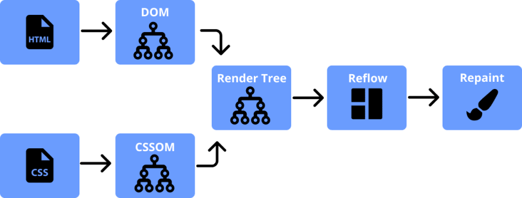

# 重排（回流）、重绘和合成

## 相关知识：浏览器如何呈现网站的

1. 从服务区获取 html 源码
2. 构建树，下面 2 个树的并行的
   1. 构建 dom 树：根据 html 源码解析出 tokens`<Tagname, Attribute, AttributeValue>`，将 tokens 转换为节点构建出 DOM 树
   2. 构建 CSSOM 树：根据 CSS 文件中的 CSS 规则构建 CSSOM 树
3. DOM 树和 CSSOM 树合并，生成渲染树 RenderTree
   1. 具体过程：从 DOM 树的根开始，计算哪些元素是可见的以及他们的计算样式
   2. 忽略不可见的元素：display 为 none 的，
   3. 将可见节点与相应的 CSSOM 规则进行匹配并应用
4. 重排 reflow：计算每个可见节点的位置和大小
5. 重绘 repaint：在浏览器上绘制

## 重排 reflow 在干什么：

根据 rendertree 计算每个可见节点的位置和大小

## 触发重排的操作：

1. 初次渲染
2. 窗口大小改变
3. 元素属性、尺寸、位置、内容改变
4. 元素字体大小变化
5. 添加或删除可见 dom 元素
6. 激活 CSS 伪类
7. 脚本操作 dom
8. 某些属性或方法（他们会刷新渲染队列，要使用他们，最好将值用变量保存起来）
   1. clientWidth 、scrollWidth、offsetWidth 等

## 减少重排的准则

1. 减少不必要的 DOM 深度，DOM 树中一个级别进行更改可能会导致该树的所有级别（上到根节点，下到所有节点的子节点）都变化。
2. 避免使用不必要且负责的 CSS 选择器，会消耗更多的 cpu 处理能力来执行选择器匹配

## 只触发重绘

1. 元素的样式如颜色改变，不影响其在文档流中位置的
2. translate，它使浏览器为元素创建一个 GPU 图层，动画在独立的层中渲染
3. visibility 变化
