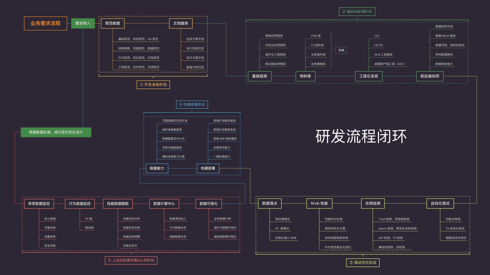

# 概览

## 前端工程化是什么

将软件工程相关的方法和思想应用到前端开发中，从而提升前端开发效率、提高产品质量、降低开发难度、减少公司成本的方法和工具。概括为四个字：**降本增效**

## 前端工程化包括什么

前端工程化贯穿整个前端项目各个阶段，包括：

1. 开发准备阶段：代码规范、流程规范、分支管理
2. 开发联调阶段：程序开发、前后端联调
3. 调试优化阶段：自动化测试
4. 构建部署阶段：应用构建、系统部署
5. 上线后监控阶段：系统监控、运维

## 前端做什么

实施前端工程化的第一步是明确前后端开发的分工，为实现前后端分离打下基础。
前端主要负责以下内容：

- 静态资源和动态资源的处理
  - 静态资源：js 文件、css 文件以及各种格式的图片、媒体文件等，这些文件不依赖于服务器，只需要在浏览器里解析
  - 动态资源：HTML 的模板，如果项目不是由服务器完成渲染的 SPA（单页面）应用，就要考虑如何实现 HTML 模板的渲染。
- JavaScript 实现前端业务逻辑
- HTML 模板文件的产出
- 中间层 Web 服务，一般由 Node.js 实现
- 前端单元测试
- 前端项目部署：静态资源文件在测试服务器上的部署，以及 HTML 模板文件在 Node.js 中间层服务器上的部署。
