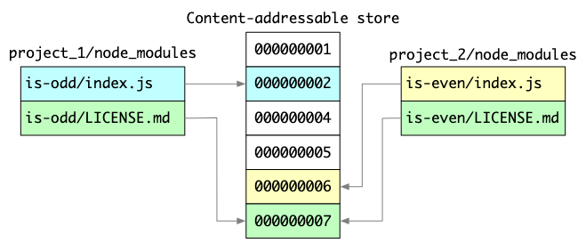
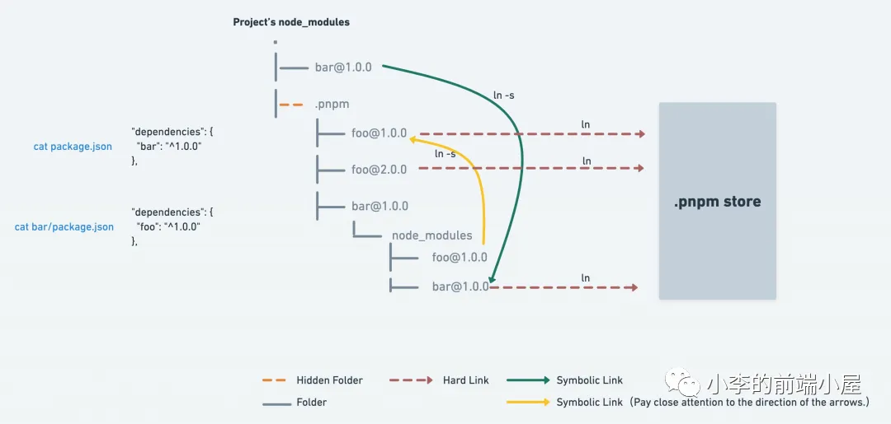

# npm VS yarn VS pnpm

都是我们经常用到的包管理工具，他们出现的先后顺序是怎样的，各自的问题有哪些，发展历程是怎样的

## npm

最早出现的包管理工具，使用 install 安装的包都安装在项目的 `node_modules` 文件夹下最早的版本是依赖的包会装在包的子目录下。这就会导致有多个相同的包存在，并且如果依赖很深的话（A 包依赖 B 包，B 包依赖 C 包，C 包依赖 D 包...）会出现**依赖地狱**的问题。

```shell
.node_modules
├── A@1.0.0
│   ├── node_modules
│   └── B@1.0.0
│        ├── node_modules
│        └── C@1.0.0
├── C@1.0.0
│   └── node_modules
│       └── B@2.0.0
└── D@1.0.0
    └── node_modules
        └── B@1.0.0
```

后来到了 v3，为了解决依赖地狱的问题，进行了扁平化，让包尽量在主依赖的 node_modules 下的展平。比如要安装的 A 包，它是依赖 B 包的，那么 A 包和 B 包都会安装在 node_modules 里面。

```shell
.node_modules
|-- A@1.0.0
|-- B@1.0.0
```

但是这会导致一个**幽灵依赖**的问题，也就是说使用`package.json`中未声明的包，我可以在项目里`import B from 'B'`，但是实际上，我没有显式地使用 npm 安装过 B 包。如果某天某个版本的 A 依赖不再依赖 B 或者 B 的版本发生了变化，那么就会造成依赖缺失或兼容性问题。

```json title="package.json"
{
  "dependencies": {
    "A": "^1.0.0",
    "C": "^1.0.0"
  }
}
```

此外，还会有一个**依赖分身**的问题，也就是说，如果后续有两个包同时依赖另一个包，那么会创建两个被依赖包的副本。
假设继续再安装依赖 B@1.0 的 D 模块和依赖 @B2.0 的 E 模块，此时：
● A 和 D 依赖 B@1.0
● C 和 E 依赖 B@2.0

```shell
node_modules
├── A@1.0.0
├── B@1.0.0
├── D@1.0.0
├── C@1.0.0
│   └── node_modules
│       └── B@2.0.0
└── E@1.0.0
    └── node_modules
        └── B@2.0.0
```

可以看到，B@2.0.0被安装了 2 次，而B@1.0.0没有。实际上无论提升 B@1.0 还是 B@2.0，都会存在重复版本的 B 被安装，这两个重复安装的 B 就叫依赖分身

## yarn

yarn 也是使用扁平化依赖管理的方法，他相对于 npm 优化的点有两个：

1. 提升安装速度
   1. 使用并行化安装
   2. 磁盘中有安装包的缓存，在下一次安装这个包时，可以脱离网络实现从磁盘离线安装
2. 固定版本：会根据 package.json 生成 yarn.lock 文件固定包的版本，记录了依赖，以及依赖的子依赖，依赖的版本，获取地址与验证模块完整性的 hash

但是，yarn 并没有解决幽灵依赖和依赖分身的问题。

## pnpm



为了解决幽灵依赖和依赖分身的问题，pnpm 在 2017 年问世了。开创了一套新的依赖管理机制。

包都是统一安装在 store 里的，依赖的每个版本只会在系统中安装一次。

node_modules 下会多出 .pnpm 目录，而且是非扁平化结构。这个目录中使用硬链接和符号链接说明了包的位置和包之间的依赖关系。

- 硬链接：指向内存中包的路径
- 符号链接：指向依赖的包的路径



```shell
node_modules
├── .pnpm
│   ├── A@1.0.0
│   │   └── node_modules
│   │       ├── A => <store>/A@1.0.0
│   │       └── B => ../../B@1.0.0
│   ├── B@1.0.0
│   │   └── node_modules
│   │       └── B => <store>/B@1.0.0
│   ├── B@2.0.0
│   │   └── node_modules
│   │       └── B => <store>/B@2.0.0
│   └── C@1.0.0
│       └── node_modules
│           ├── C => <store>/C@1.0.0
│           └── B => ../../B@2.0.0
│
├── A => .pnpm/A@1.0.0/node_modules/A
└── C => .pnpm/C@1.0.0/node_modules/C
```

其中`<store>`开头的就是硬链接，指向全局 store 中安装的依赖；其余的是符号链接，类似于一个快捷方式指向他所依赖的库真正能找到硬链接的路径

但也存在一些弊端：

1. 由于 pnpm 创建的 node_modules 依赖软链接，因此在不支持软链接的环境中，无法使用 pnpm，比如 Electron 应用。
2. 因为依赖源文件是安装在 store 中，调试依赖或 patch-package 给依赖打补丁也不太方便，可能会影响其他项目。
