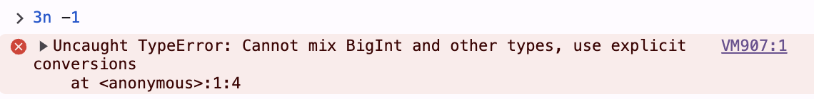

# Number 的数据范围 & Bigint

## 整数

在-2^53 ~ 2^32 之间（不含 2 个端点），900 开头的 16 位数

可以使用`MAX_SAFE_INTEGER` 和 `MIN_SAFE_INTEGER`来查看

```javascript
var biggestInt = Number.MAX_SAFE_INTEGER;
//9007199254740991
var smallestInt = Number.MIN_SAFE_INTEGER;
//-9007199254740991

console.log(Math.pow(2, 53)); //9007199254740992 这个已经不安全了
console.log(Math.pow(2, 53) + 1); //9007199254740992  可以看到这个超出精度了
console.log(-Math.pow(2, 53)); //-9007199254740992
console.log(-Math.pow(2, 53) - 1); //-9007199254740992  可以看到这个超出精度了
```

## 浮点数

Number 类型为 IEEE 754 64 位浮点类型，其中 53 位表示小数位，10 位表示指数位，1 位表示符号位。因此指数部分最大值为 2^10 = 1024， 因此 Number 的范围是 2^1024，也就是 1.7976931348623157e+308

可以用`MAX_VALUE`来查看，最小值 emm

```javascript
var biggestInt = Number.MAX_VALUE;
// 1.7976931348623157e+308
var smallestInt = Number.MIN_VALUE;
// 5e-324
```

## bigint

### 运算

bigint 支持的运输算： `+`、`*`、`-`、`**`、`%`。除 `>>>` （无符号右移）之外的 位操作 也可以支持

bigint 不能和 number 进行加减乘除等运算，会报错


### 比较

值相同的 bigint 和 Number 是 `==` 的，但是`===`是会 false 的

bigint 和 number 进行其他的 > < >= 你叫都是可以的

### 和 Number 转换

就使用 Number()和 Bigint()互相转换就行了
